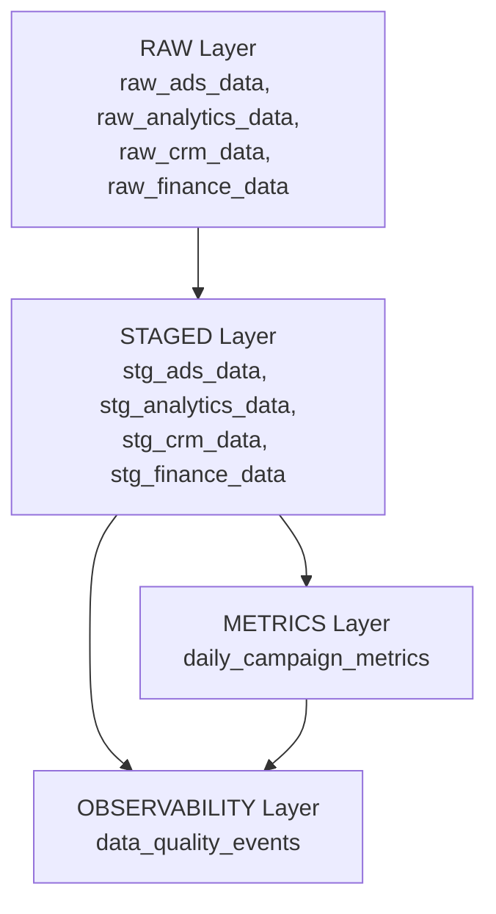

# Data Pipeline & Warehouse

A neutral, production-realistic data pipeline that ingests marketing data from a fake data service, validates it through domain rules, computes recomputed KPIs, and emits objective data quality events. This pipeline has **zero knowledge of any agent** — it only produces facts.

## Quick Start

```bash
cd dummy_data
source venv/bin/activate
pip install -r data_pipeline/requirements.txt

# Start the fake data service first (Port 8099)
python -c "import uvicorn; uvicorn.run('fake_data_service.outputs.api_server:app', port=8099)"

# In another terminal — run the pipeline
python -m data_pipeline.main run --scenario normal_flow --days 7

# Or start the read-only warehouse API
python -m data_pipeline.main serve --port 8002
```

## CLI Commands

```bash
# Run pipeline for a scenario
python -m data_pipeline.main run --scenario corrupted_finance --days 7 --date 2024-01-01

# Show pipeline status for a specific date
python -m data_pipeline.main status --date 2024-01-03

# Reset database (drop + recreate all tables)
python -m data_pipeline.main reset

# Start read-only API server
python -m data_pipeline.main serve --port 8002
```

## Database Schema (DuckDB)

The warehouse uses a 4-layer architecture:



| Layer             | Tables                                 | Purpose                                                                 |
| ----------------- | -------------------------------------- | ----------------------------------------------------------------------- |
| **RAW**           | `raw_{ads,analytics,crm,finance}_data` | Append-only, never mutated. Stores JSON payload exactly as received.    |
| **STAGED**        | `stg_{ads,analytics,crm,finance}_data` | Validated, typed, with `is_valid` and `validation_errors[]` per record. |
| **METRICS**       | `daily_campaign_metrics`               | Recomputed KPIs (ROAS, CAC, profit) from Ads+CRM. Never trusts source.  |
| **OBSERVABILITY** | `data_quality_events`                  | Neutral facts: anomalies detected, deviations measured. No severity.    |

## Read-Only Warehouse API

| Method | Endpoint                                                       | Description                                         |
| ------ | -------------------------------------------------------------- | --------------------------------------------------- |
| `GET`  | `/health`                                                      | Status, DB path, table row counts                   |
| `GET`  | `/warehouse/raw/{domain}?date=YYYY-MM-DD`                      | Raw payload rows                                    |
| `GET`  | `/warehouse/staged/{domain}?date=YYYY-MM-DD`                   | Staged rows with `is_valid` and `validation_errors` |
| `GET`  | `/warehouse/metrics?date=YYYY-MM-DD`                           | Recomputed daily campaign metrics                   |
| `GET`  | `/warehouse/quality-events?date=...&domain=...`                | Quality events (both filters optional)              |
| `GET`  | `/warehouse/quality-events/range?start=...&end=...&domain=...` | Events across a date range                          |

### Health Response

```json
{
  "status": "ok",
  "db_path": "data_pipeline.duckdb",
  "table_counts": {
    "raw_ads_data": 35,
    "stg_ads_data": 35,
    "daily_campaign_metrics": 35,
    "data_quality_events": 12
  }
}
```

### Quality Event Record

```json
{
  "id": 1,
  "created_at": "2024-01-01T00:00:00",
  "date": "2024-01-01",
  "pipeline_stage": "METRICS",
  "domain": "finance",
  "event_type": "KPI_DEVIATION",
  "metric_name": "roas",
  "observed_value": -3.85,
  "expected_value": 2.14,
  "deviation_pct": 279.91,
  "detail": null,
  "reference_table": "stg_finance_data",
  "reference_ids": [1]
}
```

## Data Quality Event Types

These are neutral measurement facts — no severity, no agent hints.

| Event Type             | What It Means                                                  |
| ---------------------- | -------------------------------------------------------------- |
| `ROW_COUNT_ZERO`       | A domain returned 0 records for that date                      |
| `ROW_COUNT_DROP`       | Row count dropped >30% vs rolling 7-day average                |
| `NULL_FIELD`           | A non-nullable field contains null values                      |
| `COLUMN_MISSING`       | An expected column is absent from the raw payload              |
| `COLUMN_UNEXPECTED`    | An unknown column is present in the raw payload                |
| `DTYPE_MISMATCH`       | A field value cannot be cast to its expected type              |
| `DUPLICATE_ROWS`       | Duplicate primary keys detected                                |
| `CONSTRAINT_VIOLATION` | A domain business rule is broken (e.g., clicks > impressions)  |
| `KPI_DEVIATION`        | Computed KPI differs from reported KPI by >1%                  |
| `FUNNEL_VIOLATION`     | Analytics funnel steps are not monotonically decreasing        |
| `CRM_LAG_DETECTED`     | Ad conversions present but no matching CRM leads within window |

## Domain Validation Rules

| Domain    | Rule                                                | Event If Violated    |
| --------- | --------------------------------------------------- | -------------------- |
| Ads       | `impressions >= clicks >= conversions`              | CONSTRAINT_VIOLATION |
| Ads       | `abs(spend - clicks*cpc) / spend < 5%`              | CONSTRAINT_VIOLATION |
| Analytics | `conversion_events <= sessions`                     | CONSTRAINT_VIOLATION |
| Analytics | `funnel_1 >= funnel_2 >= funnel_3`                  | FUNNEL_VIOLATION     |
| CRM       | `revenue IS NULL unless status='closed_won'`        | CONSTRAINT_VIOLATION |
| Finance   | `total_spend` and `total_revenue` castable to float | DTYPE_MISMATCH       |

## KPI Cross-Check (Observability Layer)

Finance KPIs are **never trusted** from the source. The pipeline recomputes them:

```
computed_roas   = SUM(crm.revenue WHERE status='closed_won') / SUM(ads.spend)
computed_cac    = SUM(ads.spend) / SUM(ads.conversions)
computed_profit = SUM(crm.revenue) - SUM(ads.spend)
```

If `|reported - computed| / computed > 1%` → emits `KPI_DEVIATION`.

## Architecture Note

This pipeline is a **neutral data system**. It has zero knowledge that an agent exists.

- ✓ Validated, typed, clean data
- ✓ Objective data quality facts (row counts, deviation %, constraint violations)
- ✓ Domain metric computations
- ✓ Neutral observability events (what happened, not what to do about it)
- ✗ No severity levels for agent decision-making
- ✗ No expected_agent_action fields
- ✗ No escalation rules or retry strategies
