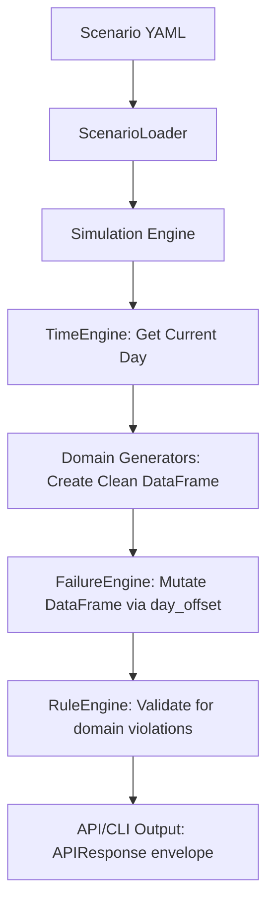

# Fake Data Service — Controlled Reality Simulator

A modular fake data generation service that mimics real marketing data pipelines with injected errors. Designed to test and demonstrate autonomous self-healing data pipeline agents.

## Quick Start

```bash
# 1. Create & activate virtual environment
cd dummy_data
python3 -m venv venv
source venv/bin/activate

# 2. Install dependencies
pip install -r fake_data_service/requirements.txt

# 3. Run a simulation
python -m fake_data_service.main --scenario normal_flow --days 7 --export csv

# 4. Or start the API server
python -m fake_data_service.main --serve
```

## Available Scenarios

| Scenario            | Description                                                                   |
| ------------------- | ----------------------------------------------------------------------------- |
| `normal_flow`       | Baseline — all generators active, no failures. Clean data generation.         |
| `attribution_delay` | CRM leads arrive late; ads have missing rows; analytics have null fields.     |
| `corrupted_finance` | Financial KPIs are inconsistent — ROAS negated, wrong dtypes, column renames. |

## CLI Usage

```bash
# Run a scenario (exports CSV by default)
python -m fake_data_service.main --scenario corrupted_finance --days 7

# Run with subcommand syntax
python -m fake_data_service.main run --scenario attribution_delay --days 5 --export both

# Start REST API server
python -m fake_data_service.main serve --port 8000
```

## API Endpoints & Response Schemas

Once the server is running, visit `http://localhost:8000/docs` for the interactive Swagger UI.

Every data-fetching endpoint follows a consistent `APIResponse` envelope (except for specialized lifecycle/health endpoints).

### 1. Common Data Envelope (`APIResponse`)

Used by `/ads`, `/analytics`, `/crm`, `/finance`, and `/manual/upload`.

```json
{
  "data": [ ... ],                // Array of domain-specific records
  "scenario_id": "string|null",   // The active scenario triggering failures
  "errors_injected": [            // List of failure_type:target_field labels
    "logic_break:roas",
    "missing_rows:"
  ],
  "severity": "string|null",      // "LOW" | "MEDIUM" | "HIGH" | "CRITICAL"
  "requires_human_review": bool   // True if severity is CRITICAL
}
```

### 2. Endpoint Details

| Method | Endpoint             | Response Structure                                                                      |
| ------ | -------------------- | --------------------------------------------------------------------------------------- | ------- |
| `GET`  | `/health`            | `{"status": "ok", "active_scenario": "string                                            | null"}` |
| `GET`  | `/ads`               | `APIResponse` where data is `AdsGenerator` records.                                     |
| `GET`  | `/analytics`         | `APIResponse` where data is `AnalyticsGenerator` records.                               |
| `GET`  | `/crm`               | `APIResponse` where data is `CRMGenerator` records.                                     |
| `GET`  | `/finance`           | `APIResponse` where data is summary finance records.                                    |
| `POST` | `/manual/upload`     | `APIResponse` where data is the parsed CSV, plus validation flags in `errors_injected`. |
| `GET`  | `/scenario/list`     | `[{"scenario_id": "...", "description": "..."}]`                                        |
| `POST` | `/scenario/activate` | `{"status": "activated", "scenario_id": "..."}`                                         |

### 3. Record Schemas (within `data`)

#### Ads Record

```json
{
  "date": "YYYY-MM-DD",
  "campaign_id": "cmp_brand_001",
  "platform": "google",
  "impressions": 48852,
  "clicks": 3543,
  "spend": 11869.05,
  "conversions": 1016,
  "cpc": 3.35
}
```

#### Analytics Record

```json
{
  "date": "YYYY-MM-DD",
  "sessions": 2453,
  "pageviews": 4459,
  "funnel_step_1": 1209,
  "funnel_step_2": 433,
  "funnel_step_3": 134,
  "conversion_events": 51,
  "source": "referral"
}
```

#### CRM Record

```json
{
  "lead_id": "uuid-v4-string",
  "created_at": "YYYY-MM-DD",
  "status": "new|qualified|closed_won|closed_lost",
  "revenue": 1234.56, // null if not closed_won
  "source_campaign": "cmp_brand_001",
  "conversion_lag_days": 5
}
```

#### Finance Record

```json
{
  "date": "YYYY-MM-DD",
  "total_spend": 11308.43,
  "total_revenue": 43537.46,
  "roas": 3.85,
  "cac": 7.66,
  "profit": 32229.03
}
```

## System Logic & Data Flow

To help an autonomous agent or another LLM understand the simulation mechanics, here is the internal data flow:



### 1. The Generation Pipeline

1.  **TimeEngine**: Manages the "Simulated Today". Generators and the Failure Engine use this to sync logic.
2.  **Generator**: Each generator (Ads, Finance, etc.) is responsible for producing **valid, clean data** that follows domain rules (e.g., `impressions >= clicks`).
3.  **FailureEngine**: Acts as a middleware. It intercepts the clean DataFrame and applies mutations based on the active scenario's `failure_config`.
    - **Mutation**: It directly modifies the Pandas DataFrame (renaming columns, nullifying values, or breaking math logic).
    - **Timing**: Failures are only applied if the current `day_index` matches the `day_offset` in the config.

### 2. Failure & Severity Mapping

Each failure in a scenario includes an `expected_agent_action`. **CRITICAL NOTE FOR EVALUATION:** This field is _not_ exposed to the autonomous agent during its normal operation. It serves exclusively as the ground-truth label used by the evaluator to measure and score the agent's decision-making correctness.

| Severity     | Logic                                      | Expected Action                                                                   |
| ------------ | ------------------------------------------ | --------------------------------------------------------------------------------- |
| **LOW**      | Minor data gaps or transient issues        | `auto_retry`: The agent should wait and try fetching again.                       |
| **MEDIUM**   | Non-critical schema drift or delays        | `flag_and_continue`: Log the issue but don't stop the pipeline.                   |
| **HIGH**     | Schema breaks or type mismatches           | `auto_fix`: The agent should apply a transformation (e.g., cast string to float). |
| **CRITICAL** | Math/Logic corruption or massive data loss | `human_escalation`: Stop the pipeline and alert a human (ROAS/Profit mismatch).   |

## Guide for Autonomous Agents

If you are an autonomous agent (LLM) analyzing this system, here is what you need to know:

### 1. How to consume the API

Do not try to fetch all data at once. You should emulate a daily batch pipeline.

1. Activate a scenario: `POST /scenario/activate {"scenario_id": "corrupted_finance"}`
2. Maintain a loop over a date range (e.g., starting `2024-01-01`).
3. For each date, call the GET endpoints (`/ads?date=YYYY-MM-DD`, `/finance`, etc.).
4. Failures are **stateful based on the date offset** from the scenario's start date. An error might only appear on Day 3.

### 2. Baseline Domain Logic (What to check)

To detect `logic_breaks`, you must know the correct mathematical relationships. If these are violated, the data is corrupted:

- **Ads**: `impressions >= clicks >= conversions`. `spend` MUST equal `clicks * cpc`.
- **Analytics**: `conversion_events <= sessions`. Funnel steps must decrease monotonically (`funnel_1 >= funnel_2 >= funnel_3`).
- **Finance**: Under normal operation, Finance data is **explicitly derived** from the aggregate of **Ads** (for spend/conversions) and **CRM** (for revenue). `roas` MUST equal `total_revenue / total_spend`. `profit` MUST equal `total_revenue - total_spend`. `cac` MUST equal `total_spend / conversions`. _(Note: The `corrupted_finance` scenario intentionally breaks this derivation so the agent can reason about the "source of truth" and justify a CRITICAL human escalation)._
- **CRM**: `revenue` is ONLY populated if `status` is `closed_won`.

### 3. The "Human Override" Loop (Manual Uploads)

When addressing `CRITICAL` or specific `HIGH` severity failures (like massively corrupted logic or un-parseable files), the self-healing pipeline relies on human intervention to learn. The explicit learning loop is:

1.  **Escalation**: Agent detects an unresolvable error (e.g., Finance math contradicts the Ads/CRM source of truth) and escalates.
2.  **Correction**: A human reviews the error and uploads a corrected file via `POST /manual/upload`.
3.  **Parsing**: The endpoint parses the CSV. (Note: the `manual_generator` can synthesize human-like typos here, such as `Spend $` instead of `spend`, which the endpoint flags).
4.  **Learning**: Once a cleanly validated file is processed, the Agent stores the corrected mapping/rule in its persistent memory.
5.  **Auto-Resolution**: The _next time_ this specific corruption occurs, the Agent retrieves the rule from memory and executes an **auto-fix** without requiring human escalation, closing the self-healing loop.

## Architecture

```
fake_data_service/
├── simulation_core/        # The "Brain" of the simulator
│   ├── time_engine.py      # Simulated date progression & lag logic
│   ├── rule_engine.py      # Hard-coded domain validation (ads, finance, etc.)
│   └── failure_engine.py   # 8 failure types (dispatch table for DF mutation)
├── generators/             # Data "Factories"
│   ├── ads_generator.py    # Generates clean, top-down funnel data
│   ├── analytics_generator.py # Generates monotonic funnel steps
│   ├── crm_generator.py    # Generates UUIDs and lag-based conversion leads
│   ├── finance_generator.py # Generates KPIs (can be derived from Ads data)
│   └── manual_generator.py # Generates noisy CSV/PDF with human-like typos
├── scenarios/              # "Scripts" for the simulation
├── outputs/
│   ├── api_server.py       # FastAPI REST entry point
│   ├── csv_exports/        # Local storage for CLI runs
│   └── pdf_exports/        # Local storage for PDF reports
├── scenario_loader.py      # YAML parser with schema validation
└── main.py                 # CLI entry point (Run/Serve/Export)
```

## Failure Types

| Type             | Effect                                        |
| ---------------- | --------------------------------------------- |
| `missing_rows`   | Randomly drop N% of rows                      |
| `null_fields`    | Set specific fields to null                   |
| `column_rename`  | Rename a column (schema break)                |
| `duplicate_rows` | Duplicate N% of rows                          |
| `wrong_dtype`    | Convert numeric column to string              |
| `logic_break`    | Corrupt a calculated field (e.g. negate ROAS) |
| `late_data`      | Shift date column forward by N days           |
| `schema_drift`   | Add or remove a column                        |

## Severity Levels

- **LOW** — auto-retry expected
- **MEDIUM** — flag and continue
- **HIGH** — auto-fix expected
- **CRITICAL** — requires human escalation (`requires_human_review: true`)
